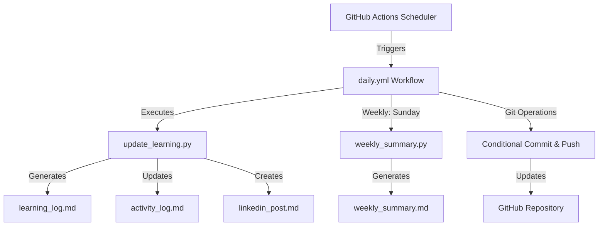
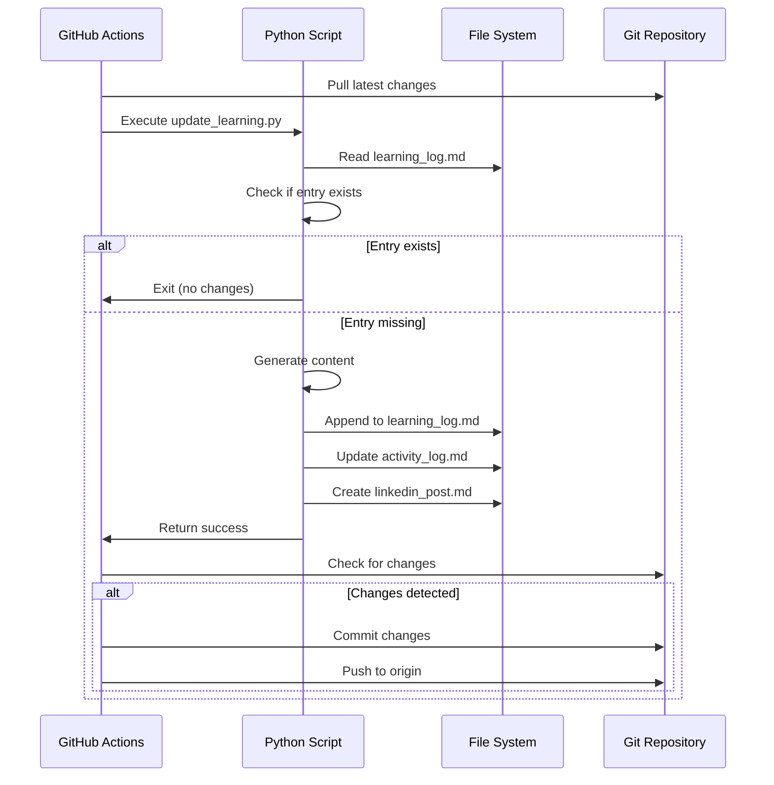

# 🏗️ Architecture Documentation

> **Technical deep-dive into the dev-daily-tracker automation system**

---

## 📐 System Overview

This document explains the **technical design decisions, guarantees, and implementation details** of the automated learning documentation system.

### **Core Components**



---

## 🎯 Design Objectives

### **1. Idempotent Execution**

**Definition**: The workflow can run multiple times safely without side effects.

**Implementation**:
- Pull before push (`git pull origin main`)
- Commit only if changes detected (`git diff --quiet` check)
- No force pushes
- No destructive operations

**Why This Matters**:
- Manual reruns don't break state
- Concurrent executions don't conflict
- Failed runs can be retried safely

---

### **2. Race Condition Prevention**

**Problem**: GitHub Actions can:
- Run on schedule
- Be triggered manually
- Retry automatically on failure

**Solution**:
```yaml
# Always sync with remote before operations
- name: Pull latest changes
  run: git pull origin main

# Only push if there are actual changes
- name: Check for changes
  run: |
    if git diff --quiet && git diff --staged --quiet; then
      echo "No changes to commit"
      exit 0
    fi
```

**Guarantee**: No Git history corruption, even under concurrent execution.

---

### **3. Separation of Concerns**

| Layer | Responsibility | Technology |
|-------|---------------|------------|
| **Orchestration** | Scheduling, triggering, coordination | GitHub Actions |
| **Business Logic** | Content generation, topic selection | Python scripts |
| **Storage** | Learning artifacts, logs, summaries | Markdown files |
| **Version Control** | History, state management | Git |

**Benefits**:
- Easier debugging (isolate failures)
- Easier testing (run Python separately)
- Easier extension (add new scripts)

---

## 🔄 Workflow Execution Flow

### **Daily Workflow (`daily.yml`)**

```yaml
name: Daily Learning Update

on:
  schedule:
    - cron: '0 9 * * *'  # 9:00 AM UTC daily
  workflow_dispatch:     # Manual trigger

jobs:
  update:
    runs-on: ubuntu-latest
    steps:
      1. Checkout repository
      2. Set up Python
      3. Pull latest changes
      4. Run update_learning.py
      5. Configure Git identity
      6. Check for changes
      7. Commit (if changes exist)
      8. Push to origin/main
```

### **Step-by-Step Breakdown**

#### **Step 3: Pull Latest Changes**
```bash
git pull origin main
```
- Ensures local branch is in sync
- Prevents push conflicts
- Handles external manual commits

#### **Step 4: Run Python Script**
```bash
python scripts/update_learning.py
```
- Generates learning log entry
- Updates activity tracking
- Creates LinkedIn content
- **Deterministic**: Same day = same output

#### **Step 6: Check for Changes**
```bash
git diff --quiet && git diff --staged --quiet
```
- Returns exit code 0 if no changes
- Workflow exits gracefully
- **No empty commits**

#### **Step 7: Conditional Commit**
```bash
git add .
git commit -m "📚 Daily learning update"
```
- Only runs if Step 6 failed (changes exist)
- Uses semantic commit message
- Includes all modified files

#### **Step 8: Safe Push**
```bash
git push origin main
```
- Push to remote
- Will succeed because we pulled first
- No `--force` flag (safe)

---

## 🐍 Python Script Design

### **`update_learning.py` Architecture**

```python
# Pseudocode structure

def main():
    1. Get current date
    2. Check if entry already exists (idempotent)
    3. Select random topic from domain pool
    4. Generate learning log entry
    5. Append to learning_log.md
    6. Update activity_log.md
    7. Create linkedin_post.md
    8. Generate image prompt (optional)

# Domain Rotation Strategy
domains = ['AI', 'DSA', 'System Design']
selected_domain = random.choice(domains)

# Topics per domain
ai_topics = [...]
dsa_topics = [...]
sysdesign_topics = [...]
```

### **Key Design Choices**

#### **1. Idempotent Entry Creation**
```python
# Don't duplicate entries for the same day
today = datetime.now().strftime("%Y-%m-%d")

with open('learning_log.md', 'r') as f:
    content = f.read()
    if f"## {today}" in content:
        print("Entry already exists, skipping")
        return
```

#### **2. Random but Seeded Topic Selection**
```python
# Use date as seed for reproducibility
random.seed(int(datetime.now().strftime("%Y%m%d")))
topic = random.choice(topic_pool)
```
- Same day = same topic
- Prevents duplicate runs from creating different content

#### **3. Append-Only Operations**
```python
# Never overwrite existing content
with open('learning_log.md', 'a') as f:
    f.write(new_entry)
```
- Preserves history
- Easy to audit changes
- No data loss

---

## 🛡️ Guarantees & Safety

### **System Guarantees**

| Guarantee | Implementation |
|-----------|----------------|
| **No Force Pushes** | No `--force` flag anywhere |
| **No Empty Commits** | `git diff` check before commit |
| **No Git Conflicts** | Always pull before push |
| **No Duplicate Entries** | Date-based idempotency check |
| **No Data Loss** | Append-only file operations |
| **No Broken History** | Sequential commit workflow |

### **Failure Modes & Handling**

| Failure Scenario | Behavior | Recovery |
|------------------|----------|----------|
| **Script error** | Workflow fails, no commit | Check logs, fix script, rerun |
| **Git conflict** | Pull fails, workflow stops | Manual resolution needed |
| **Nothing changed** | Graceful exit, no commit | Expected behavior |
| **Push rejected** | Workflow fails | Re-pull and retry |

---

## 🎨 Human-Like Behavior Patterns

### **Why Simulate Human Learning?**

Goal: Make automated activity **indistinguishable from manual learning**.

### **Techniques**

#### **1. Random Topic Selection**
```python
random.choice(topics)  # Different topic each day
```
- Avoids suspicious patterns
- Mimics real learning curiosity

#### **2. Domain Rotation**
```python
domains = ['AI', 'DSA', 'System Design']
# Natural variation across weeks
```
- Realistic learning breadth
- Prevents automation detection

#### **3. Weekend Behavior (Optional)**
```python
if datetime.now().weekday() >= 5:  # Saturday/Sunday
    # Could adjust content length or skip
    pass
```
- Not yet implemented
- Future enhancement for realism

#### **4. Conditional Commits**
```yaml
# Only commit when there are actual changes
```
- Real developers don't commit empty changes
- Workflow stops itself when appropriate

---

## 📊 Data Flow Diagram



---

## ⚙️ Configuration & Customization

### **Workflow Schedule**

```yaml
# Current: Daily at 9:00 AM UTC
cron: '0 9 * * *'

# Alternative schedules:
# Every 12 hours:   '0 */12 * * *'
# Weekdays only:    '0 9 * * 1-5'
# Multiple times:   '0 9,18 * * *'
```

### **Topic Pools**

Edit `scripts/update_learning.py`:

```python
AI_TOPICS = [
    "Transformer Architecture",
    "Reinforcement Learning",
    "GANs and Generative Models",
    # Add more...
]

DSA_TOPICS = [
    "Graph Algorithms",
    "Dynamic Programming",
    "Tree Traversals",
    # Add more...
]
```

### **Output Formats**

Add new generators:

```python
# scripts/generate_twitter_thread.py
# scripts/generate_blog_post.py
# scripts/update_notion_database.py
```

---

## 🔬 Testing Strategy

### **Local Testing**

```bash
# Test learning update
python scripts/update_learning.py

# Verify output
cat learning_log.md | tail -20

# Test weekly summary
python scripts/weekly_summary.py
cat weekly_summary.md
```

### **GitHub Actions Testing**

1. **Manual Trigger**
   - Go to "Actions" tab
   - Select "Daily Learning Update"
   - Click "Run workflow"

2. **Check Logs**
   - View workflow execution
   - Verify steps completed
   - Check commit history

3. **Validate Output**
   - Pull latest changes
   - Review generated content
   - Confirm commit message

---

## 🚧 Future Enhancements

### **Planned Features**

- [ ] **Notion Integration** — Sync to Notion database
- [ ] **Statistics Dashboard** — Generate learning analytics
- [ ] **GitHub Profile README** — Auto-update profile with stats
- [ ] **Email Digest** — Weekly summary via email
- [ ] **Mobile Notifications** — Push alerts on new entries

### **Technical Improvements**

- [ ] **Error Notifications** — Alert on workflow failures
- [ ] **Content Quality Checks** — Validate output format
- [ ] **Performance Metrics** — Track execution time
- [ ] **Automated Testing** — Unit tests for Python scripts

---

## 🔍 Monitoring & Debugging

### **Check Workflow Status**

```bash
# View recent workflow runs
gh run list --workflow=daily.yml

# View specific run logs
gh run view <run-id> --log
```

### **Common Issues**

| Issue | Diagnosis | Solution |
|-------|-----------|----------|
| **No commits** | Check workflow logs | Verify script executed |
| **Duplicate entries** | Check date parsing | Fix idempotency logic |
| **Git conflicts** | Manual changes not pulled | Resolve conflicts manually |
| **Script errors** | Python exceptions | Check logs, fix script |

---

## 📚 References

### **Technologies Used**

- **GitHub Actions** — [Documentation](https://docs.github.com/en/actions)
- **Python 3.9+** — [Docs](https://docs.python.org/3/)
- **Git** — [Pro Git Book](https://git-scm.com/book)
- **Markdown** — [Guide](https://www.markdownguide.org/)

### **Design Inspiration**

- **CI/CD Best Practices** — Idempotent pipelines
- **Event-Driven Architecture** — Scheduled triggers
- **Content Automation** — Safe, reproducible generation

---

## 🧠 Design Philosophy

> **"Build systems that are harder to break than to use."**

This architecture prioritizes:
1. **Safety** over speed
2. **Correctness** over features
3. **Simplicity** over cleverness

Every design choice asks:
- **Can this corrupt Git history?** → No
- **Can this create duplicate data?** → No
- **Can this fail silently?** → No
- **Can this be run multiple times safely?** → Yes

---

## 📬 Questions?

For implementation details, see the code directly:
- [`.github/workflows/daily.yml`](./.github/workflows/daily.yml)
- [`scripts/update_learning.py`](./scripts/update_learning.py)
- [`scripts/weekly_summary.py`](./scripts/weekly_summary.py)

Need help? Open an issue or reach out!
